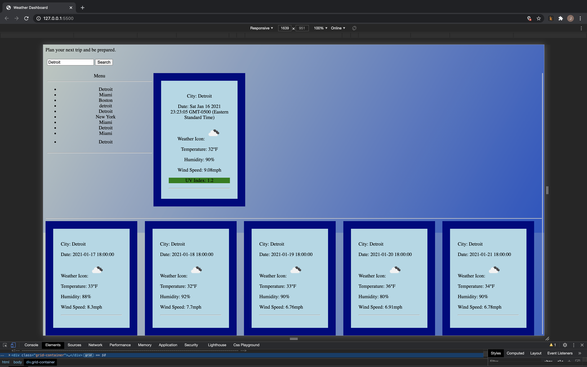

# Weather-Dashboard

---

## Preview

## Description

This webpage displays weather outlook for multiple cities for people that enjoy traveling

---

## Developers

James J. Gault

---

## Technologies

1. HTML
2. CSS
3. JavaScript
4. JQuery
5. OpenWeather API

---

## Foresight

The future features of this website will include enhanced search experiences when looking up the weather in other cities.(A suggested agenda should go along with the search results)

---

## Incentive

This website could help someone plan a vacation or plan around unfavorable weather conditions.

---

## Challenges

Some challenges with this website consisted of getting the forecasts' date to display properly, getting the weather icon to display properly, and getting the bootstrap to render the way that I wanted it to.

---

## Reasoning

The reason for having this website is to see the forecast of any US city for five days in case you are planning a trip and want to know what weather issues you might run into.

---

## Solution

Having a five day forecast of every city that you search for along with the uv index should help the user of this website to determine if their trip should consist of rain boots of sandals.

---

## Take away

The main take away from this project was to show how api data could dynamically update a html document's information without refreshing the page.

---